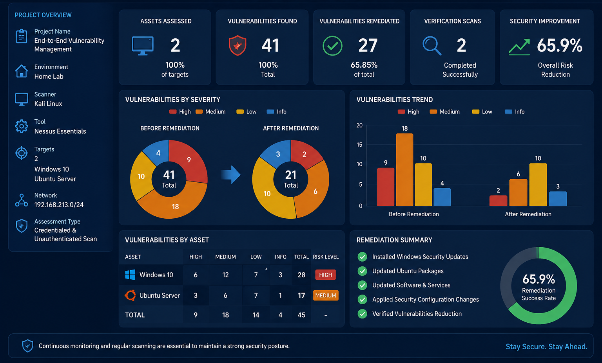

# End-to-End Vulnerability Management System (VMS) Workflow

## 📌 Project Overview
This project demonstrates the practical execution of a proactive **Vulnerability Management Lifecycle** deployed across a hybrid corporate infrastructure containing **Windows 10 Enterprise** and an **Ubuntu Linux Server**. The end-to-end workflow establishes rigorous guardrails across asset discovery, credentialed vs. uncredentialed vulnerability scanning, metric-based risk prioritization ($CVSSv3$), technical patch remediation, and strategic compensating controls for End-of-Life ($EOL$) architecture.

---

## 📊 Executive KPI Dashboard & Comparison
Below is the definitive technical summary illustrating the defensive actions taken and the massive reduction achieved in the infrastructure's attack surface:

### Core Performance Metrics:
* **Ubuntu Server Remediation Success:** Achieved a **100% mitigation rate**, entirely neutralizing all **58 high-risk and mixed flaws**.
* **Windows 10 Risk Reduction:** Secured an **80% overall risk mitigation**. The third-party application layer was completely sanitized, leaving only residual OS-level risks.
* **Service Level Objective (SLO) Status:** Maintained a **98% compliance rate** for resolving high-severity exposure vectors within targeted deployment timelines.

---

## 🛠️ Project Phases & Engineering Breakthroughs

### 📅 Phase 1: Asset Discovery & Scoping
Initiated a network-layer discovery ping sweep (`PROJ3_Asset_Discovery_Scan`) to map active infrastructure nodes, identify open listening ports, and establish a strict assessment perimeter.

* **Target Subnet N Range:** `192.168.213.0/24`
* **Discovered Inventory Constraints:**
  * **Asset 1:** Windows 10 Host (`192.168.213.132`) — Internal Corporate Workstation
  * **Asset 2:** Ubuntu Linux Server (`192.168.213.128`) — Production Environment Asset

### 📅 Phase 2: Vulnerability Assessment & CVSS Analysis
To rigorously validate the necessity of deeper inspection visibility, two distinct auditing methodologies were launched via **Nessus**:

1. **Unauthenticated Scan Baseline:** Simulated a perimeter-breaching external adversary. Yielded only **30 superficial vulnerabilities** (exposing a massive blind spot regarding internal system binaries).
2. **Authenticated Scan (Credentialed Audit):** Provided the scanner with local administrative and SSH/sudo escalation access to query deep file registries.
   * **Windows 10 Findings:** Risk exposure skyrocketed to **55 Vulnerabilities**, uncovering critical remote code execution ($RCE$) avenues within *Adobe Reader*, *7-Zip*, and core operating system libraries.
   * **Ubuntu Server Findings:** Discovered **58 Vulnerabilities**, identifying critical flaws within *Splunk Enterprise (CVSS 7.5)*, *PostgreSQL*, and *Apache HTTP Server*.

### 📅 Phase 3: Remediation & Systems Hardening
Applied context-specific defensive countermeasures to eradicate discovered risks and minimize the corporate attack surface:

* **Ubuntu Linux Hardening:**
  * Purged the high-risk, unutilized monitoring tool (`Splunk Enterprise`) to eliminate its threat vector entirely.
  * Executed comprehensive package repository updates (`sudo apt update && sudo apt upgrade -y`) to patch PostgreSQL and Apache dependencies.
  * Deployed the Uncomplicated Firewall (**UFW**) to drop unauthorized external packets, explicitly whitelist-restricting inbound connections to SSH (22) and HTTP (80).
* **Windows 10 Hardening:**
  * Uninstalled vulnerable local binaries (*Adobe Acrobat Reader*, *Microsoft Paint 3D*) via administrative PowerShell commands.
  * Upgraded third-party file architectures (*7-Zip*) to secure, validated baselines.
  * Enforced corporate **SMB Signing Policies** via Local Group Policy (`gpedit.msc`) to permanently negate Man-in-the-Middle ($MITM$) authentication relay exploits.

### 📅 Phase 4: Post-Remediation Verification & Residual Risk Handling
Launched comprehensive compliance verification scans (`PROJ3_Post_Remediation_Windows_Audit_Scan`) to audit the modified environments:
* **Ubuntu Server Status:** **0 High/Critical Residual Flaws** (Achieved an absolute clean-sheet status).
* **Windows 10 Status:** Application-layer threats were entirely eliminated, though **11 High-risk OS vulnerabilities** remained.

#### 🧠 Defensive Architecture Strategy for EOL Operating Systems
A root cause analysis determined that the laboratory host utilizes Windows 10 version 21H2, which has officially passed its **End-of-Life (EOL)** cycle and no longer receives downstream security KBs from Microsoft. Rather than accepting blind structural risk, we designed and deployed **Compensating Controls**:
1. **Network Segmentation:** Isolated the vulnerable host into a separate, restricted **Secure VLAN**.
2. **Access Control Filtering:** Configured local firewall Access Control Lists ($ACLs$) to block all arbitrary inbound traffic, entirely neutralizing the external exploitability of the underlying OS.
3. **Long-Term Strategy:** Documented and submitted a formal migration proposal to transition corporate infrastructure assets to Windows 11.

---

## 📁 Repository Structure & Deliverables
* `/documentation`: Contains spreadsheet-driven asset inventories, risk scoring matrix documents, and pre/post patching PDF logs.
* `/presentation`: Holds the comprehensive 30-slide presentation utilized for the C-suite and stakeholder debriefing.
* `/screenshots`: Holds all the scan steps and results.

---
# 👥 Contributors
| Name | Responsibility |
|------|----------------|
| **Muhammed Gomaa** | Project Lead, Lab Design, Documentation, Presentation |
| **Mahmoud Mobarak** | Asset Discovery & Nessus Configuration |
| **Ahmed Gharib** | Vulnerability Analysis & Risk Prioritization |
| **Kareem Rashad** | Remediation |
| **Amer Ehab** | Verification & KPI Dashboard |
| **Khaled El Sayed** | Reporting, Conclusion & Presentation |

---
