# End-to-End Vulnerability Management Using Nessus Essentials🛡️ 

<p align="center">
  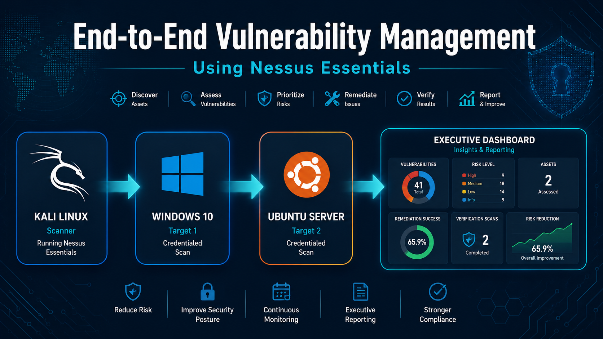
</p>

<p align="center">


</p>

---

## 📌 Overview

This project demonstrates a complete **End-to-End Vulnerability Management Lifecycle** in a simulated enterprise environment using **Nessus Essentials**.

Instead of performing only vulnerability scanning, this project follows the complete security workflow used in real organizations:

- Asset Discovery
- Vulnerability Assessment
- Risk Prioritization
- Remediation
- Verification Scanning
- Executive Reporting
- KPI Dashboard

The lab simulates an enterprise environment containing Windows and Linux systems connected inside a private network.

---

# 📑 Table of Contents

- Overview
- Project Objectives
- Lab Environment
- Network Topology
- Project Workflow
- Technologies Used
- Project Structure
- Screenshots
- Results
- Executive Dashboard
- Documentation
- Future Improvements
- Contributors

---

# 🎯 Project Objectives

The main objectives of this project are:

- Build a realistic Enterprise Home Lab
- Discover network assets
- Perform Credentialed and Unauthenticated Vulnerability Scans
- Identify security weaknesses
- Prioritize vulnerabilities using CVSS
- Apply remediation actions
- Verify remediation effectiveness
- Measure security improvement
- Produce executive-level reports

---

# 🏗️ Lab Environment

| Component | Description |
|------------|------------|
| Scanner | Kali Linux |
| Target 1 | Windows 10 Workstation |
| Target 2 | Ubuntu Server |
| Scanner Tool | Nessus Essentials |
| Network | 192.168.213.0/24 |

---

# 🌐 Network Topology

<p align="center">

</p>

---

# 🔄 Vulnerability Management Lifecycle

The project follows the complete Vulnerability Management lifecycle:

```
Asset Discovery
        │
        ▼
Vulnerability Assessment
        │
        ▼
Risk Prioritization
        │
        ▼
Remediation
        │
        ▼
Verification Scan
        │
        ▼
Executive Reporting
```

---

# ⚙️ Technologies Used

- Nessus Essentials
- Kali Linux
- Ubuntu Server
- Windows 10
- SSH
- CVSS
- PowerPoint
- Draw.io


---

# 📸 Project Screenshots

## Lab Architecture

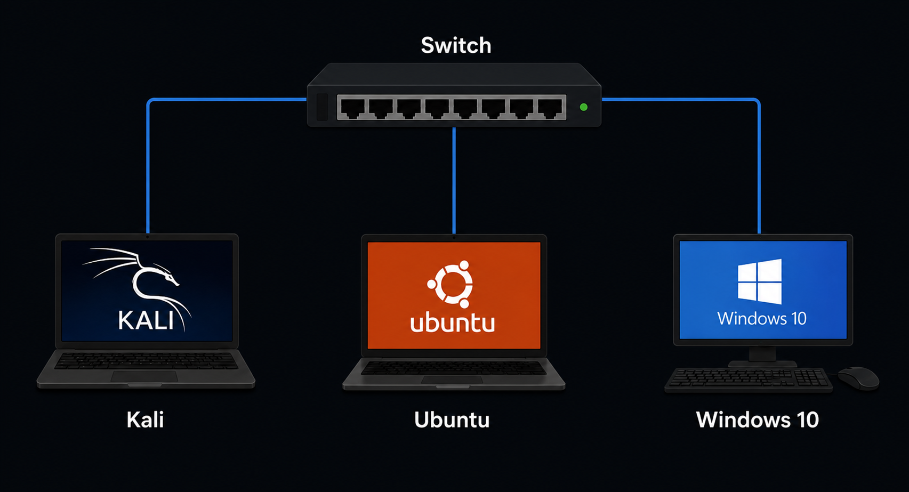

---

## Asset Discovery

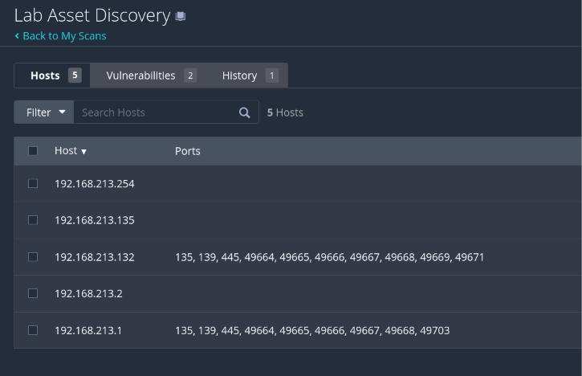

---

## Windows Vulnerability Scan

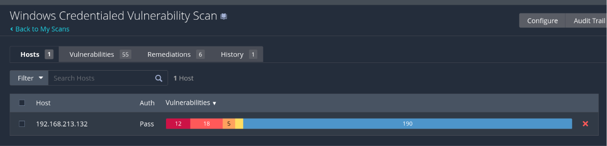

---

## Ubuntu Vulnerability Scan

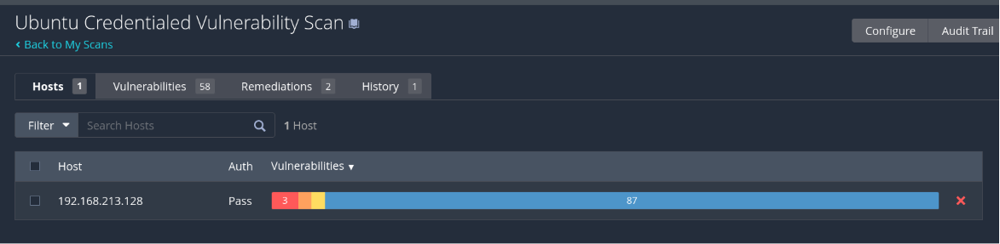

---

## Windows Findings

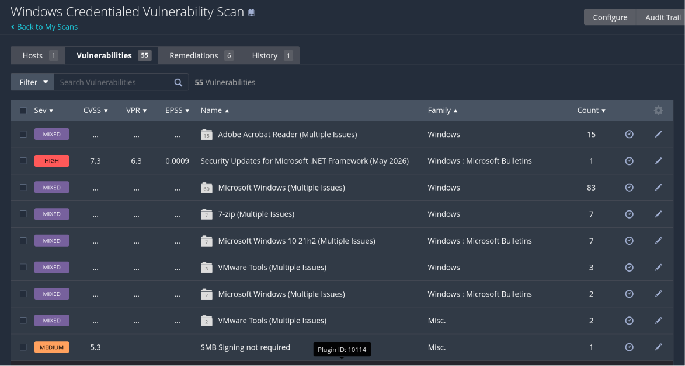

---

## Ubuntu Findings

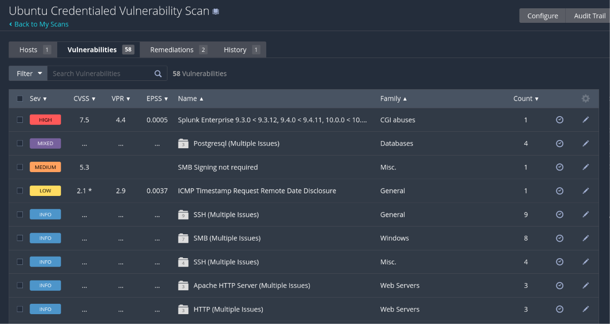

---

## Credentialed Scan

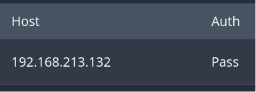

---

## Ubuntu Remediation

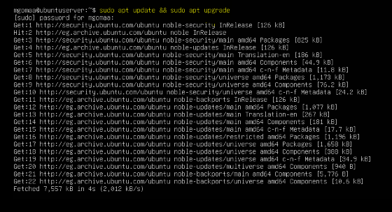

---

## Windows Remediation

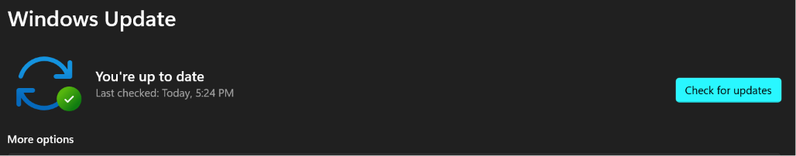

---

## Ubunto Verification Scan

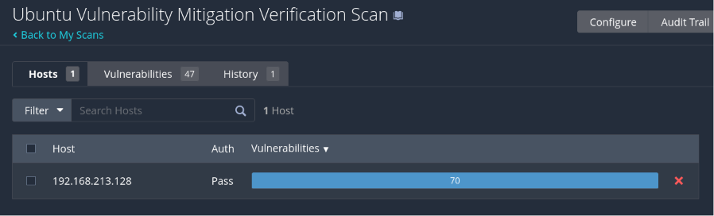

---
## Windows Verification Scan

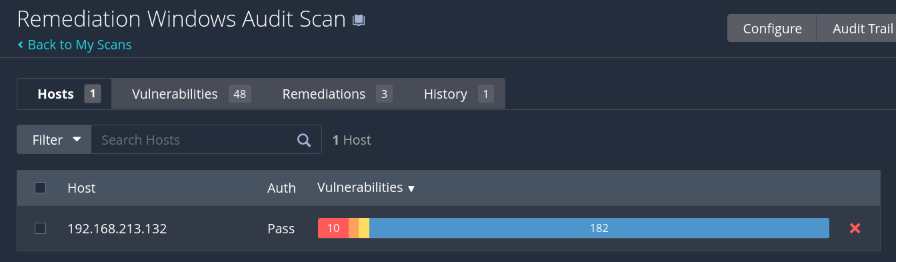

---

## Before vs After Comparison

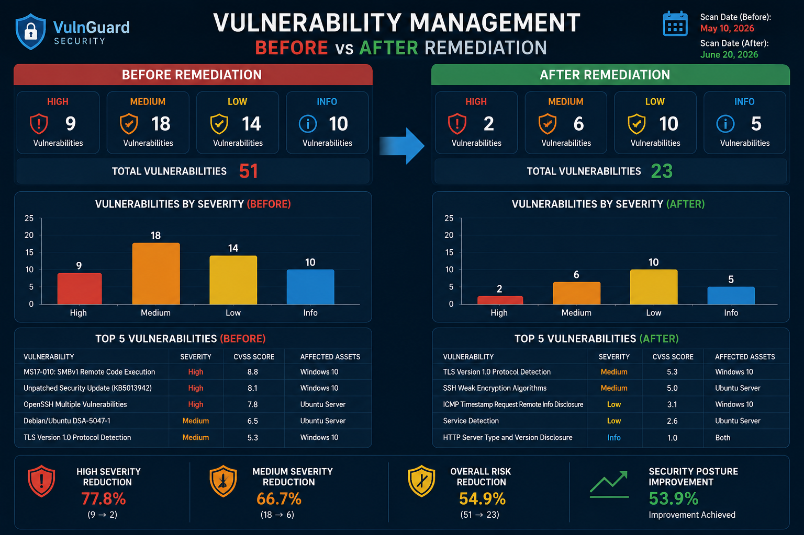

---

## Executive KPI Dashboard


---

# 📊 Key Results

✔ Successfully discovered all network assets

✔ Performed Credentialed Vulnerability Assessment

✔ Identified High, Medium, and Low vulnerabilities

✔ Prioritized risks using CVSS

✔ Applied remediation actions

✔ Reduced overall security risks

✔ Verified remediation using rescanning

✔ Produced Executive KPI Dashboard

✔ Generated complete technical documentation

---

# 📈 Executive Dashboard

The project includes an executive dashboard summarizing:

- Assets Assessed
- Credentialed Scans
- High Risk Reduction
- Medium Risk Reduction
- Verification Success
- Overall Security Improvement

---

# 📄 Documentation

The repository includes:

- Full Project Documentation
- Final Presentation
- Network Diagram
- Screenshots
- Executive KPI Dashboard

---

# 🚀 Future Improvements

Possible future enhancements include:

- SIEM Integration (Splunk)
- Patch Management Automation
- Continuous Monitoring
- Scheduled Vulnerability Scans
- Vulnerability Trend Analysis
- Multi-Subnet Assessment
- Integration with Ticketing Systems


---

# 🎓 Academic Project

This project was developed for educational purposes to demonstrate practical implementation of enterprise Vulnerability Management concepts.

---

## 📁 Repository Structure & Deliverables
* `/documentation`: Contains spreadsheet-driven asset inventories, risk scoring matrix documents, and pre/post patching PDF logs.
* `/presentation`: Holds the comprehensive 30-slide presentation utilized for the C-suite and stakeholder debriefing.
* `/screenshots`: Holds all the scan steps and results.

---
# 👥 Contributors
| Name | Responsibility |
|------|----------------|
| **Muhammed Gomaa** | Project Lead, Lab Design, Documentation, Presentation |
| **Mahmoud Mobarak** | Asset Discovery & Nessus Configuration |
| **Ahmed Gharib** | Vulnerability Analysis & Risk Prioritization |
| **Kareem Rashad** | Remediation |
| **Amer Ehab** | Verification & KPI Dashboard |
| **Khaled El Sayed** | Reporting, Conclusion & Presentation |

---
